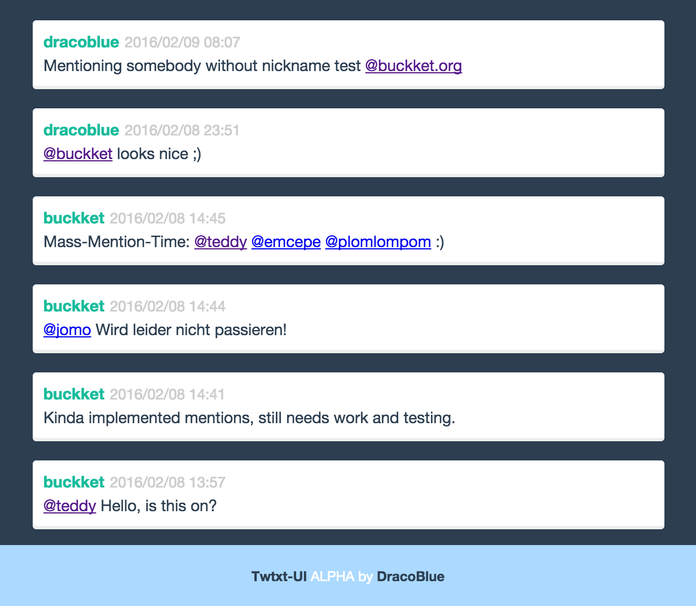

# Twtxt UI for Webbrowser

A simple web driven ui for twtxt (uses local storage and a nodejs server). Demo:

## Requirements:

- Serverside: [nodejs](https://nodejs.org)
- Clientside: A Recent Webbrowser

## Demo

At: <https://web.twtxt.org>

Screenshot:

## How to Use

1. Clone the repo: `git clone git@github.com:DracoBlue/twtxt-ui`
2. Go into folder: `cd twtxt-ui`
3. Install dependencies: `npm install`
4. Build dependencies: `npm build`
5. Start the app: `node server.js`
6. View in browser at: `http://localhost:8080`

## Features

* Web-Client
* Follow/Unfollow people
* Login with a specific twtxt-Url
* Show `@mentions` of that twtxt-Url
* Browser-Notifications on new Mentions/Tweets
* Stored in LocalStorage
* **Missing**: Posting new Twtxt-Messages. Please use the official cli client at <https://github.com/buckket/twtxt> for this (so far)

## Usage

You can "login" with your twtxt-Url (no password required). This information will be visible after page refresh,
because the information is stored in the localStorage of your browser.

## Contributions

* This is a twtxt fork of the react/twitter example at <https://github.com/scotch-io/react-tweets>
* This is based on the code repository for the tutorial by @kenwheeler: [Build A Real-Time Twitter Stream with Node and React.js](http://scotch.io/tutorials/javascript/build-a-real-time-twitter-stream-with-node-and-react-js)

## License

This work is copyright by DracoBlue (http://dracoblue.net) and licensed under the terms of MIT License.